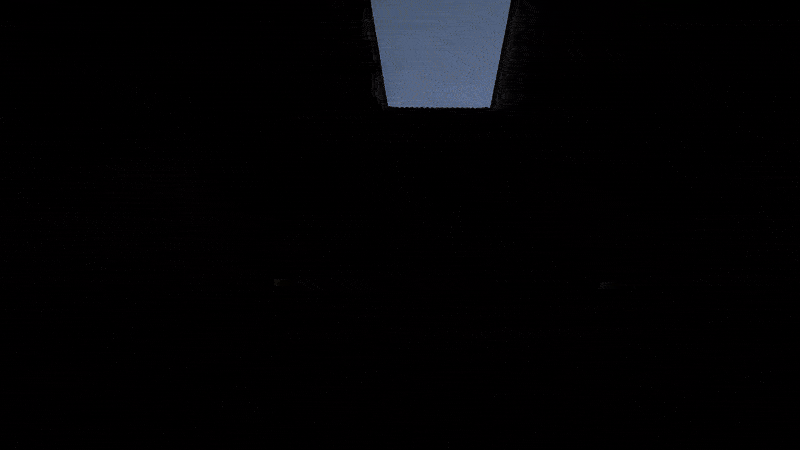

# Unity BRP Screen Space Global Illumination (SSGI)

  

This is a **simple and lightweight implementation** of **Screen Space Global Illumination** (SSGI) for Unity's Built-in Render Pipeline (BRP). It features a fully ray-marching approach and provides both global illumination and ambient occlusion support with minimal setup and no external dependencies.

---

## Features

- Screen Space Global Illumination (GI)
- Screen Space Ambient Occlusion (AO)
- Combined GI + AO mode
- Simple Gaussian blur for final smoothing
- No compute shaders – pure full-screen passes
- Easy to integrate into any BRP project

---

## How to Use

1. **Add the script:**
   - Attach `SSGI.cs` to your main **Camera**.

2. **Attach the shader:**
   - Assign the included `Hidden/SSGI` shader to the script via the Inspector.

3. **Configure as needed:**
   - Tweak sample counts, distances, and intensity values via the exposed public fields in the script.

That’s it! You're ready to see dynamic screen-space GI in your scene.

---

## Notes

- **Not Compatible with Unity's Post Processing Stack**  
  Since this system is applied directly to the camera, it cannot render *between* Unity’s built-in post-processing stack passes.  
  This limits integration with custom effects like bloom, color grading, etc.

- **Suboptimal Denoising and Performance**  
  The current denoiser is simplistic. Without temporal reprojection, the results may appear noisy, especially at low sample counts.  
  Overall performance and visual quality still need improvement.
  
- **Temporal Reprojection Removed:**  
  Temporal reprojection was removed due to visible ghosting and instability issues. Will be re-evaluated in future versions.

- **No Bilateral Upscaling:**  
  Bilateral upscaling before the blur pass has been disabled, as it caused significant performance overhead without sufficient visual gain. current version using multi-iteration of gaussian blur if needed

---

## Shader Overview

This project includes a single-pass ray-marching shader that:

- Traces screen-space rays in view space
- Detects indirect light bounces using GBuffer data
- Supports cosine-weighted sampling
- Handles both GI and AO
- Applies depth + normal-aware Gaussian blur to smooth the result
- Composites indirect lighting into the final frame

---

## Tested On

- Unity 2021.3 and Unity 6
- Built-in Render Pipeline (BRP)
- Deferred rendering paths only

---

## License

Free to use and modify!
